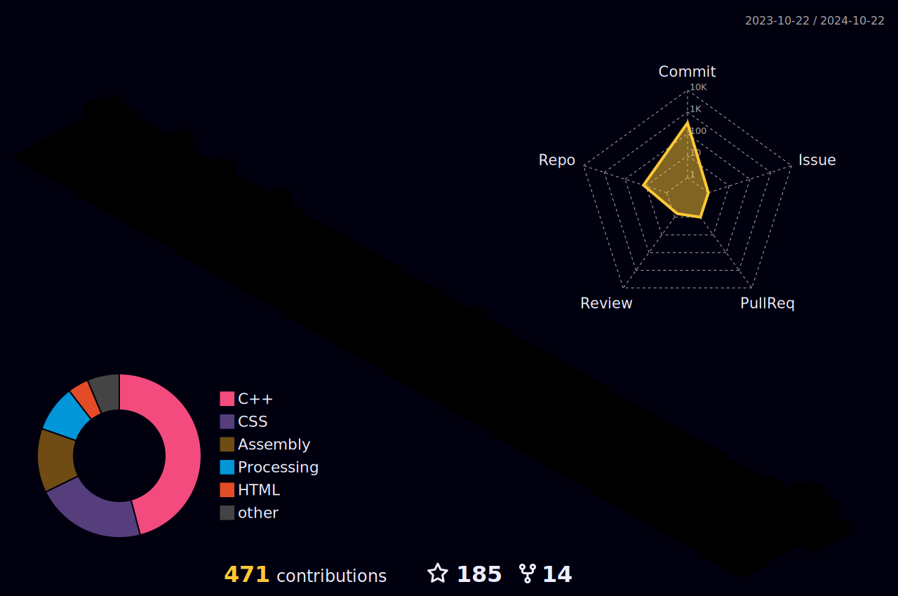

<h1 align="center">
  
</h1>

<h1> About me </h1>

<pre><code>
░░░░░░░░░░░░░░░░░░░░░░░░░░░░░░░░░░░░░░░░░░░░░░░░░░░░░░░░░░░░
░▒▓██████████████▓▒░░░░░░░▒▓████████▓▒░░░░░░░▒▓███████▓▒░░░░
░▒▓█▓▒░░▒▓█▓▒░░▒▓█▓▒░░░░░░▒▓█▓▒░░░░░░░░░░░░░░▒▓█▓▒░░░░░░░░░░
░▒▓█▓▒░░▒▓█▓▒░░▒▓█▓▒░░░░░░▒▓█▓▒░░░░░░░░░░░░░░▒▓█▓▒░░░░░░░░░░
░▒▓█▓▒░░▒▓█▓▒░░▒▓█▓▒░░░░░░▒▓██████▓▒░░░░░░░░░░▒▓██████▓▒░░░░
░▒▓█▓▒░░▒▓█▓▒░░▒▓█▓▒░░░░░░▒▓█▓▒░░░░░░░░░░░░░░░░░░░░░▒▓█▓▒░░░
░▒▓█▓▒░░▒▓█▓▒░░▒▓█▓▒░░░░░░▒▓█▓▒░░░░░░░░░░░░░░░░░░░░░▒▓█▓▒░░░
░▒▓█▓▒░░▒▓█▓▒░░▒▓█▓▒░░░░░░▒▓████████▓▒░░░░░░░░▒▓███████▓▒░░░
░░░░░░░░░░░░░░░░░░░░░░░░░░░░░░░░░░░░░░░░░░░░░░░░░░░░░░░░░░░░
</code></pre>

Hello! I'm Mes, a student from Taiwan majoring in Computer Engineering & Mathematics.
 
 
I'm a huge fan of C++. Inspired by TCCPP, I'm currently dedicating myself to studying the C++ standards, aspiring to one day become a member of the C++ committee! I also enjoy working with OpenGL & Vulkan.
 
 
Previously, I worked as a network administrator (MIS) at the Computing Center of the Mathematics Department at National Central University for a year. During that time, I collaborated with my colleagues to build our server cluster from scratch using Proxmox, which was a very fulfilling experience.
 
 
Now, I'm back to my core interests, continuing my studies on the Linux kernel and Computer Graphics. I also occasionally return to the Computing Center to help with server-related issues :D
 
 
I love writing and have a Chinese column called Cpp Miner, where I introduce and explain modern C++ features. Besides that, I also share my thoughts and learnings on my blog from time to time.
 
 
Lastly, I'm a huuuge fan of Hololive. My favorite members are Ina, Lap, and Shion. To follow them more closely, I worked hard to learn Japanese, and now I can communicate in Chinese, English, and briefly Japanese.

<h1> Statistics </h1>

 

  

    
    
  

           
  

    
  

   

  

<h1> Repositories </h1>
 

  

      

  
  

      

<h1> Contribution calender</h1>

 

<h1> Acknowledgement</h1>

- https://github.com/zumrudu-anka/zumrudu-anka/tree/master
