 

  

<h1> About me </h1>

Hello! I'm Mes, a student from Taiwan majoring in Computer Engineering & Mathematics.

I'm a huge fan of C++. Inspired by TCCPP, I'm currently dedicating myself to studying the C++ standards, aspiring to one day become a member of the C++ committee! I also enjoy working with OpenGL & Vulkan.

Previously, I worked as a network administrator (MIS) at the Computing Center of the Mathematics Department at National Central University for a year. During that time, I collaborated with my colleagues to build our server cluster from scratch using Proxmox, which was a very fulfilling experience.

Now, I'm back to my core interests, continuing my studies on the Linux kernel and Computer Graphics. I also occasionally return to the Computing Center to help with server-related issues :D

I love writing and have a Chinese column called Cpp Miner, where I introduce and explain modern C++ features. Besides that, I also share my thoughts and learnings on my blog from time to time.

Lastly, I'm a huuuge fan of Hololive. My favorite members are Ina, Lap, and Shion. To follow them more closely, I worked hard to learn Japanese, and now I can communicate in Chinese, English, and briefly Japanese.

<h1> Statistics </h1>

   

<h1> Contact</h1>

<ul>
<li>
  <a href = "mailto:mes900903@gmail.com">Email</a>: mes900903@gmail.com
</li>
<li>
  Discord: mes_0903
</li>
</ul>

<h1> Acknowledgement</h1>

<ul>
  <li><a href="https://github.com/ppodds">ppodds</a></li>
</ul>
